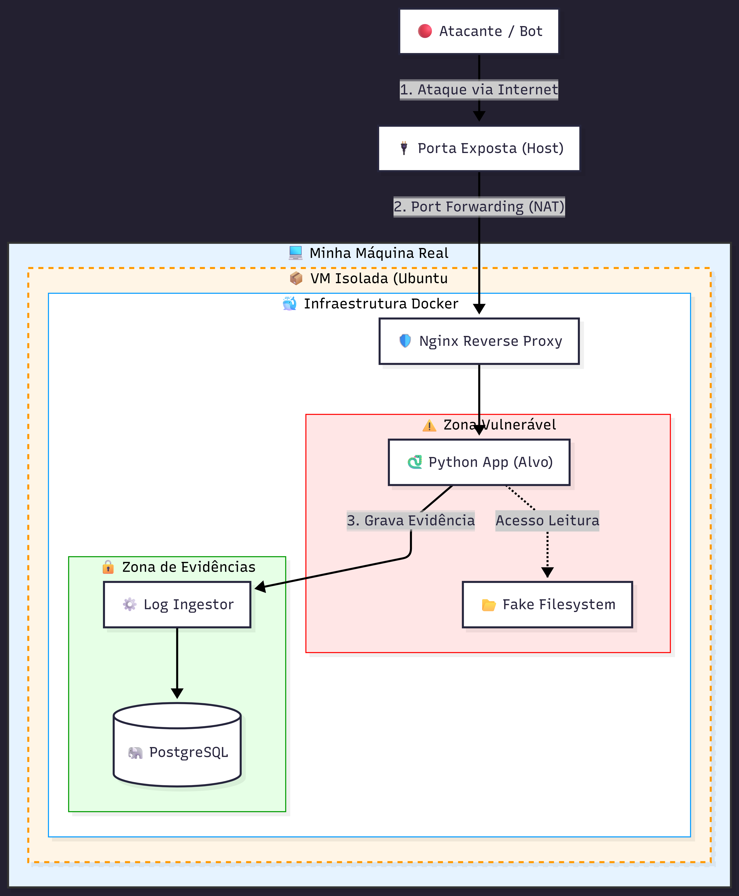

# 🛡️ GhostVault - Enterprise Honeypot & Threat Intelligence System

> **Sistema de detecção de intrusão baseado em engano (honeypot) que simula uma infraestrutura vulnerável para capturar, registrar e analisar tentativas de exploração em tempo real.**



---

## 🚀 Sobre o Projeto

O **GhostVault** é uma arquitetura de segurança ofensiva/defensiva (Purple Team). O sistema atua como um "pote de mel" (Honeypot) de Alta Interação, respondendo a ataques simulando falhas de segurança reais (como erros de SQL falsos) para manter o atacante engajado enquanto o backend coleta inteligência forense.

### Principais Funcionalidades
* **Active Deception:** Algoritmos que detectam padrões de ataque e retornam erros falsos para enganar hackers.
* **Infraestrutura Isolada:** Ambiente rodando em containers Docker sem acesso à rede host.
* **Auditoria Forense:** Log de IP, Geolocalização, Payload Bruto e User-Agent em banco PostgreSQL oculto.
* **Dashboard em Tempo Real:** Interface visual para monitoramento de ameaças.

---

## 🛠️ Tecnologias Utilizadas

* **Backend:** Python (FastAPI) + Regex Threat Detection
* **Database:** PostgreSQL 15 (Logs de Auditoria & Tabelas Fakes)
* **Frontend:** Next.js + TailwindCSS
* **Infraestrutura:** Docker & Docker Compose
* **Redes:** Nginx Reverse Proxy

---

## ⚡ Como Rodar o Projeto (Passo a Passo)

Siga este guia para implantar a infraestrutura completa em sua máquina local para testes e desenvolvimento.
ATENÇÃO: Recomendo fortemente realizar a implantação fora de sua rede principal (seja ela corporativa ou residencial). Faça como foi feito o projeto, suba uma VM que não possua conectividade e interação direta com sua rede e máquina principal. 
PS: Existem chances reais de atacantes conseguirem invadir sua rede através da VM, se mal configurada. Caso não sinta segurança em realizar esse experimento, não realize.

### 📋 Pré-requisitos

Certifique-se de ter instalado:
1.  **Docker Desktop** (Com suporte a Linux Containers ativo).
2.  **Git**.

### 🔧 Instalação e Execução

**1. Clone o repositório**
Abra seu terminal e baixe os arquivos do projeto:
```bash
git clone [https://github.com/d34uthy/ghostvault.git](https://github.com/d34uthy/ghostvault.git)
cd ghostvault

cp .env.example .env
docker-compose up --build

Acesse a API vulnerável em https://localhost:8000 (Lembre de subir um servidor real à rede externa para melhor coleta de dados)

Caso queira realizar um teste de ataque, use: "curl -X POST "http://localhost:8000/auth/login" -d "username=admin' OR 1=1 --&password=teste" e se atente aos logs do terminal.